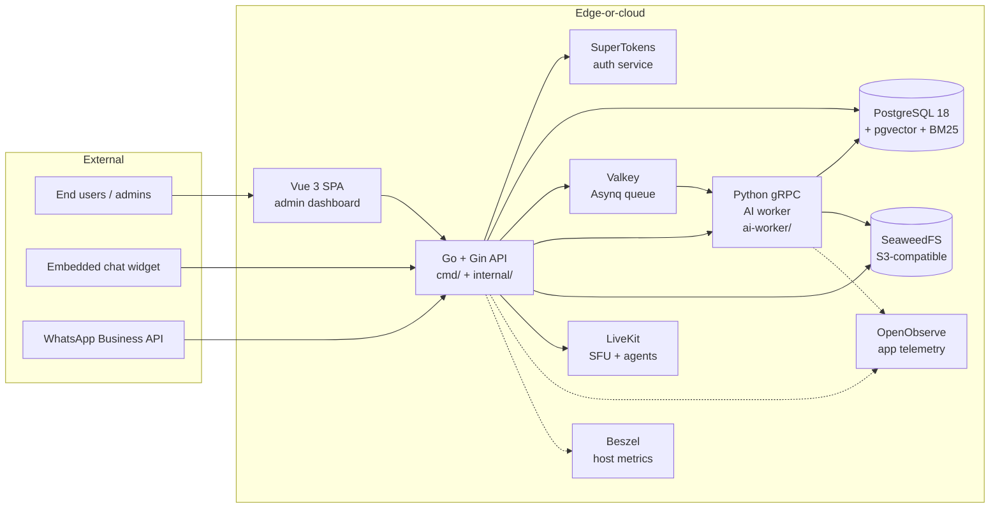

# Raven — Architecture Overview

This document describes the Raven system's actors, components, and trust boundaries at a level sufficient for a security reviewer or new contributor to reason about data flow and attack surface. It satisfies **OSPS-SA-01.01** from the [OpenSSF Baseline](https://baseline.openssf.org/versions/2026-02-19).

For a deeper feature-level walkthrough see [`docs/wiki/Architecture-Overview.md`](wiki/Architecture-Overview.md). For the historical design document see [`docs/superpowers/specs/`](superpowers/specs/).

> **Threat model & attack-surface analysis** are deferred to Level 3 compliance and will be tracked in `docs/compliance/` once added.

## System Diagram



## Actors

| Actor | Interaction | Trust level |
|---|---|---|
| End user (org member) | Uses the SPA or embedded widget | Low — authenticated via SuperTokens |
| Admin (org owner) | Manages workspaces, KBs, API keys | Medium — session-scoped, MFA recommended |
| API client (external system) | Calls `/api/v1/*` with API key | Low — key-scoped to a KB |
| LLM provider (Anthropic / OpenAI / Cohere) | Called by AI worker with tenant-supplied keys (BYOK) | External — no credentials flow back to Raven |
| AI worker | Embeds, retrieves, generates responses | Internal — trusted, sandboxed via gRPC boundary |
| Ingestion job | Parses uploaded documents / scraped pages | Internal — untrusted input |
| Observability agent (OpenObserve, Beszel) | Receives telemetry | Internal — one-way push |

## Components

| Component | Language / Runtime | Responsibility |
|---|---|---|
| API server | Go 1.26 + Gin | REST, auth, tenant routing, SSE streaming, RLS-scoped DB access |
| AI worker | Python + gRPC | Embedding generation, hybrid retrieval (pgvector + BM25 + RRF), LLM orchestration, document parsing |
| Frontend | Vue 3 + TypeScript + Tailwind | Admin dashboard (SPA), embeddable `<raven-chat>` web component |
| Auth | SuperTokens | Email/password + OAuth (Google), session management, MFA |
| Database | PostgreSQL 18 | Primary store; pgvector for embeddings, ParadeDB/BM25 for lexical search, RLS for tenant isolation |
| Job queue | Valkey + Asynq (Go) | Asynchronous document processing, rate limiting, SHA256 response cache |
| Object storage | SeaweedFS | S3-compatible file store for uploads + media |
| Realtime media | LiveKit (server + agents) | WebRTC SFU, voice pipeline (STT → LLM → TTS) |
| App telemetry | OpenObserve | Logs, traces, metrics via OpenTelemetry |
| Host metrics | Beszel | Agent + hub for Raspberry Pi / VM host vitals |

## Data Hierarchy

```
Organization  (tenant boundary — PostgreSQL RLS)
  └── Workspace  (operational sub-unit within org)
       └── Knowledge Base  (collection of documents + web sources)
            ├── Source  (upload, URL, scrape)
            │    └── Document  (parsed content)
            │         └── Chunk  (retrieval unit)
            │              └── Embedding  (pgvector + BM25 index)
            └── APIKey  (KB-scoped, used by embeddable widget / external clients)
```

RLS policies on `documents`, `chunks`, `embeddings`, `cache`, and `sources` enforce that `org_id` on every row matches the session's `app.org_id` setting. Cross-org reads return zero rows; cross-org writes fail.

## Trust Boundaries

1. **External ↔ API** — every request traverses the API's auth middleware. Embeddable widget traffic authenticates by API key bound to a specific KB; browser sessions use SuperTokens cookies.
2. **API ↔ Data plane (DB, Valkey, object store)** — the API holds the only credentials and always sets `app.org_id` before any query. Direct DB access from any other component is forbidden.
3. **API ↔ AI worker (gRPC)** — intra-network gRPC; the worker does not trust arbitrary callers but in practice is reachable only from the API.
4. **Edge ↔ Cloud (optional)** — when deployed split between a Raspberry Pi (API) and a cloud AI worker, the gRPC channel is TLS-terminated; the edge node holds only short-lived session material.
5. **User content ↔ LLM providers** — tenant-supplied BYOK credentials live in Postgres (encrypted at rest). The AI worker uses them for outbound calls; response content is stored in the per-KB cache when hit.

## Core Data Flows

### Document ingestion

```
user → FE upload form → API /sources → SeaweedFS (blob)
                              │
                              ▼
                        Valkey queue (ingest job)
                              │
                              ▼
                        AI worker: parse → chunk → embed → persist
                              │
                              ▼
                        PostgreSQL (chunks + embeddings)
```

### Chat / retrieval

```
user → FE or embedded widget → API /chat
                                  │
                                  ▼
                              AI worker (gRPC):
                                1. Hybrid search (pgvector + BM25 + RRF)
                                2. Response cache lookup (SHA256 of query)
                                3. If miss: LLM call with retrieved context
                                4. Store response in cache
                                  │
                                  ▼
                              API → SSE stream → client
```

### Voice session

```
user → FE WebRTC client → LiveKit SFU
                             │
                             ▼
                        LiveKit agent (Python):
                             STT → LLM (via AI worker) → TTS
                             │
                             ▼
                        LiveKit SFU → audio back to user
```

## Security-Relevant Notes

- **Secrets at rest** — tenant API keys (for LLM providers) encrypted with per-deployment AES-GCM; encryption key held in env (`RAVEN_SECRET_KEY`) or KMS.
- **Session transport** — all external traffic is TLS (Traefik terminates); WebSockets and SSE inherit the outer TLS.
- **Tenant isolation** — enforced at the row level by RLS (database layer), not relying on application-layer filtering alone.
- **Dependency trust** — see [`docs/dependency-policy.md`](dependency-policy.md).
- **Vulnerability disclosure** — see [`SECURITY.md`](../SECURITY.md).

## Out of Scope

- **Enterprise Edition** (files prefixed `ee-`) are licensed separately and not part of the L2-compliance scope.
- **Billing integrations** (Razorpay / Hyperswitch / UPI) use tenant-supplied gateway keys and inherit the BYOK trust model.
